# ABA System Model UML Diagrams

Last updated: 2026-07-14

This note turns the current ABA system model into diagrams for workshop use.

Scope:

- public capture routes
- CRM/shared database records
- membership management
- admin/operator side
- finance and activation
- user accounts, roles, and workspace access
- communications and opt-ins
- registration tracker and public dashboard

Source notes:

- `docs/requirements/aba-system-model-workshop-reference.md`
- `docs/requirements/aba-unified-membership-tracker-system-contract.md`
- `docs/requirements/aba-membership-type-policy.md`
- `docs/requirements/aba-public-capture-field-map.md`
- `docs/requirements/aba-admin-ia-and-module-plan.md`
- `registration-tracker/data-model-v1.md`

## 1. Whole shared database model

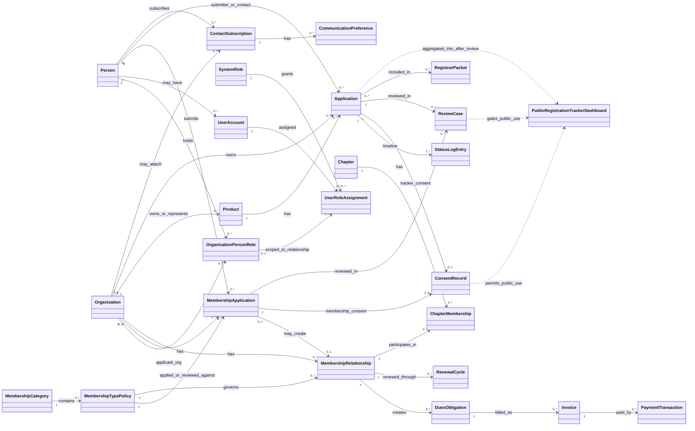
```mermaid
classDiagram
    direction LR

    class Person
    class Organization
    class OrganizationPersonRole
    class UserAccount
    class UserRoleAssignment
    class SystemRole

    class MembershipApplication
    class MembershipRelationship
    class MembershipCategory
    class MembershipTypePolicy

    class DuesObligation
    class Invoice
    class PaymentTransaction
    class RenewalCycle

    class Chapter
    class ChapterMembership

    class Product
    class Application
    class StatusLogEntry
    class ConsentRecord
    class ReviewCase
    class RegistrarPacket
    class PublicRegistrationTrackerDashboard

    class ContactSubscription
    class CommunicationPreference

    Person "1" --> "0..*" OrganizationPersonRole : holds
    Organization "1" --> "0..*" OrganizationPersonRole : has

    Person "1" --> "0..*" UserAccount : may_have
    UserAccount "1" --> "0..*" UserRoleAssignment : assigned
    SystemRole "1" --> "0..*" UserRoleAssignment : grants
    OrganizationPersonRole "0..1" --> "0..*" UserRoleAssignment : scoped_to_relationship

    Person "1" --> "0..*" MembershipApplication : submits
    Organization "0..1" --> "0..*" MembershipApplication : applicant_org
    MembershipCategory "1" --> "0..*" MembershipTypePolicy : contains
    MembershipTypePolicy "1" --> "0..*" MembershipApplication : applied_or_reviewed_against
    MembershipApplication "0..1" --> "0..1" MembershipRelationship : may_create
    Organization "1" --> "0..*" MembershipRelationship : has
    MembershipTypePolicy "1" --> "0..*" MembershipRelationship : governs

    MembershipRelationship "1" --> "0..*" DuesObligation : creates
    DuesObligation "1" --> "0..*" Invoice : billed_as
    Invoice "1" --> "0..*" PaymentTransaction : paid_by
    MembershipRelationship "1" --> "0..*" RenewalCycle : renewed_through

    Chapter "1" --> "0..*" ChapterMembership : has
    MembershipRelationship "1" --> "0..*" ChapterMembership : participates_in

    Organization "1" --> "0..*" Product : owns_or_represents
    Organization "1" --> "0..*" Application : owns
    Product "1" --> "0..*" Application : has
    Person "1" --> "0..*" Application : submitter_or_contact

    Application "1" --> "1..*" StatusLogEntry : timeline
    Application "1" --> "0..1" ConsentRecord : tracker_consent
    MembershipApplication "1" --> "0..1" ConsentRecord : membership_consent
    ContactSubscription "1" --> "0..*" CommunicationPreference : has

    MembershipApplication "1" --> "0..*" ReviewCase : reviewed_in
    Application "1" --> "0..*" ReviewCase : reviewed_in
    Application "0..*" --> "0..*" RegistrarPacket : included_in
    Application ..> PublicRegistrationTrackerDashboard : aggregated_into_after_review
    ReviewCase ..> PublicRegistrationTrackerDashboard : gates_public_use
    ConsentRecord ..> PublicRegistrationTrackerDashboard : permits_public_use

    Person "1" --> "0..*" ContactSubscription : subscribes
    Organization "0..1" --> "0..*" ContactSubscription : may_attach
```

Reading:

- this is one shared database, not a membership database plus a separate tracker database
- admin, CRM, membership, comms, and tracker records all sit on the same shared model
- public routes create source records; review, finance, and user access sit on top of them

## 2. CRM and admin-side entity model

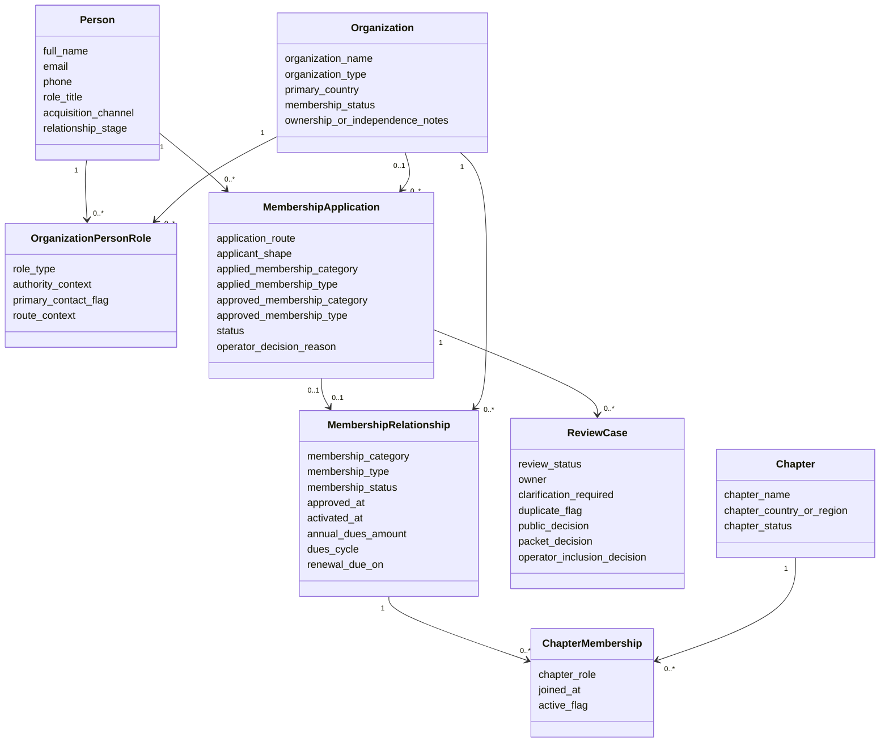
```mermaid
classDiagram
    direction TB

    class Person {
      full_name
      email
      phone
      role_title
      acquisition_channel
      relationship_stage
    }

    class Organization {
      organization_name
      organization_type
      primary_country
      membership_status
      ownership_or_independence_notes
    }

    class OrganizationPersonRole {
      role_type
      authority_context
      primary_contact_flag
      route_context
    }

    class MembershipApplication {
      application_route
      applicant_shape
      applied_membership_category
      applied_membership_type
      approved_membership_category
      approved_membership_type
      status
      operator_decision_reason
    }

    class MembershipRelationship {
      membership_category
      membership_type
      membership_status
      approved_at
      activated_at
      annual_dues_amount
      dues_cycle
      renewal_due_on
    }

    class ReviewCase {
      review_status
      owner
      clarification_required
      duplicate_flag
      public_decision
      packet_decision
      operator_inclusion_decision
    }

    class Chapter {
      chapter_name
      chapter_country_or_region
      chapter_status
    }

    class ChapterMembership {
      chapter_role
      joined_at
      active_flag
    }

    Person "1" --> "0..*" OrganizationPersonRole
    Organization "1" --> "0..*" OrganizationPersonRole
    Person "1" --> "0..*" MembershipApplication
    Organization "0..1" --> "0..*" MembershipApplication
    MembershipApplication "0..1" --> "0..1" MembershipRelationship
    MembershipApplication "1" --> "0..*" ReviewCase
    Organization "1" --> "0..*" MembershipRelationship
    MembershipRelationship "1" --> "0..*" ChapterMembership
    Chapter "1" --> "0..*" ChapterMembership
```

Reading:

- `Person` and `Organization` are CRM/shared records
- `OrganizationPersonRole` is where relationship roles live
- `MembershipApplication` is the captured application
- `MembershipRelationship` is the approved ongoing relationship
- `ReviewCase` is the admin/operator workflow record

## 3. Admin module model

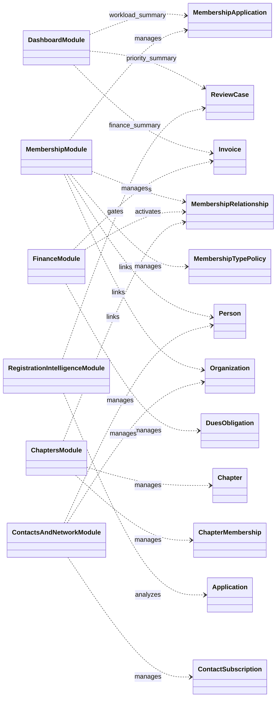
```mermaid
classDiagram
    direction LR

    class DashboardModule
    class MembershipModule
    class FinanceModule
    class ChaptersModule
    class RegistrationIntelligenceModule
    class ContactsAndNetworkModule

    class MembershipApplication
    class MembershipRelationship
    class MembershipTypePolicy
    class DuesObligation
    class Invoice
    class Chapter
    class ChapterMembership
    class Application
    class ReviewCase
    class Person
    class Organization
    class ContactSubscription

    DashboardModule ..> MembershipApplication : workload_summary
    DashboardModule ..> ReviewCase : priority_summary
    DashboardModule ..> Invoice : finance_summary

    MembershipModule ..> MembershipApplication : manages
    MembershipModule ..> MembershipRelationship : manages
    MembershipModule ..> MembershipTypePolicy : manages
    MembershipModule ..> Person : links
    MembershipModule ..> Organization : links

    FinanceModule ..> MembershipRelationship : activates
    FinanceModule ..> DuesObligation : manages
    FinanceModule ..> Invoice : manages

    ChaptersModule ..> Chapter : manages
    ChaptersModule ..> ChapterMembership : manages
    ChaptersModule ..> MembershipRelationship : links

    RegistrationIntelligenceModule ..> Application : analyzes
    RegistrationIntelligenceModule ..> ReviewCase : gates

    ContactsAndNetworkModule ..> Person : manages
    ContactsAndNetworkModule ..> Organization : manages
    ContactsAndNetworkModule ..> ContactSubscription : manages
```

Reading:

- this is the "admin side" as an internal product
- the modules sit on one shared database
- `Membership`, `Finance`, and `Registration Intelligence` are different modules because they act on different records and decisions

## 4. Status reference

This is the current best status map from the repo.

### 4.1 Prospect / lead-like records

There is **not yet** one locked, formal `Lead` object with its own status model.

The repo currently points instead to:

- `Person.relationship_stage`
- prospect `Person` / prospect `Organization`
- `MembershipApplication` states
- `ContactSubscription.active_status`

So if you are asking for "CRM lead statuses", the honest answer is:

- the older word `lead` still appears in places
- the cleaner model is moving toward `Person`, `Organization`, `MembershipApplication`, and `ContactSubscription`
- a dedicated lead/prospect status model is still not fully locked

### 4.2 Membership application states

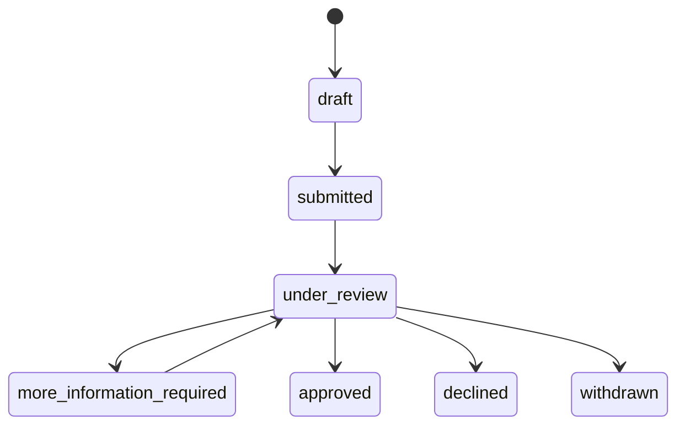
```mermaid
stateDiagram-v2
    [*] --> draft
    draft --> submitted
    submitted --> under_review
    under_review --> more_information_required
    more_information_required --> under_review
    under_review --> approved
    under_review --> declined
    under_review --> withdrawn
```

Current canonical states from the shared system notes:

- `draft`
- `submitted`
- `under_review`
- `more_information_required`
- `approved`
- `declined`
- `withdrawn`

### 4.3 Membership relationship states

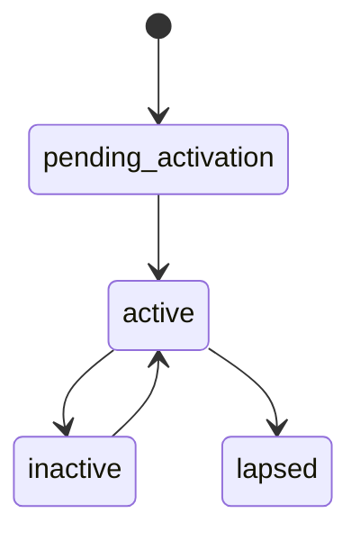
```mermaid
stateDiagram-v2
    [*] --> pending_activation
    pending_activation --> active
    active --> inactive
    active --> lapsed
    inactive --> active
```

Current canonical states:

- `pending_activation`
- `active`
- `inactive`
- `lapsed`

### 4.4 Review case states

Current canonical states:

- `new`
- `in_review`
- `clarification_requested`
- `resolved`
- `excluded`

### 4.5 Tracker application status model

The tracker is using three different but related layers:

1. `service/application type`
2. `current status`
3. `official stage`

The source-grounded official stages are:

- `Verification`
- `Scientific screening`
- `Evaluation`
- `Decision`
- `Appeal`

Examples of current tracker status labels already used in the repo:

- `Preparing submission`
- `Submitted to registrar`
- `Query / additional information requested`
- `Approved / registered`
- `Under technical review`

Examples of current tracker stage labels already used in the repo:

- `Pre-submission`
- `Received`
- `Referred back`
- `Evaluation`
- `Decision -> registered`

### 4.6 Communications/subscription status

The current model is lighter here.

What is visible so far:

- `ContactSubscription.active_status`
- `CommunicationPreference.consent_state`

The repo clearly models opt-ins, but does **not** yet give a deeply locked subscription-state machine.

## 5. User accounts, roles, and workspace access

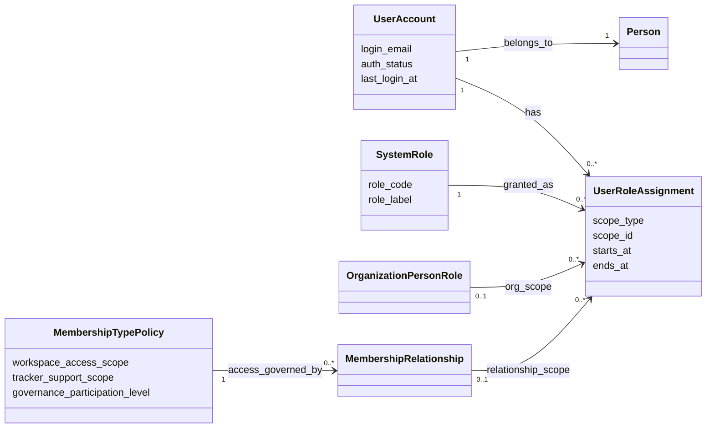
```mermaid
classDiagram
    direction LR

    class UserAccount {
      login_email
      auth_status
      last_login_at
    }

    class SystemRole {
      role_code
      role_label
    }

    class UserRoleAssignment {
      scope_type
      scope_id
      starts_at
      ends_at
    }

    class Person
    class OrganizationPersonRole
    class MembershipRelationship
    class MembershipTypePolicy {
      workspace_access_scope
      tracker_support_scope
      governance_participation_level
    }

    UserAccount "1" --> "1" Person : belongs_to
    UserAccount "1" --> "0..*" UserRoleAssignment : has
    SystemRole "1" --> "0..*" UserRoleAssignment : granted_as
    OrganizationPersonRole "0..1" --> "0..*" UserRoleAssignment : org_scope
    MembershipRelationship "0..1" --> "0..*" UserRoleAssignment : relationship_scope
    MembershipTypePolicy "1" --> "0..*" MembershipRelationship : access_governed_by
```

Suggested current role set from the repo:

- `member_company_user`
- `aba_admin`
- `finance_admin`
- `chapter_admin`
- `technical_network_admin`

Notes:

- the repo clearly defines role boundaries conceptually
- the exact final auth/permission model is still lighter than the data model
- `Registrar/export context` is currently more of a controlled admin/export mode than a standalone end-user role

## 6. Membership policy, packages, and privileges

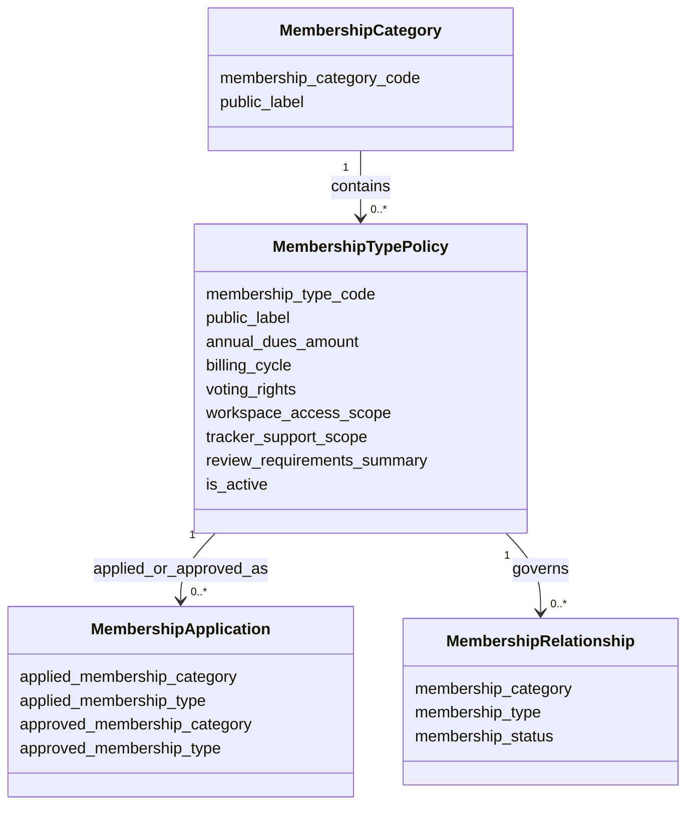
```mermaid
classDiagram
    direction TB

    class MembershipCategory {
      membership_category_code
      public_label
    }

    class MembershipTypePolicy {
      membership_type_code
      public_label
      annual_dues_amount
      billing_cycle
      voting_rights
      workspace_access_scope
      tracker_support_scope
      review_requirements_summary
      is_active
    }

    class MembershipApplication {
      applied_membership_category
      applied_membership_type
      approved_membership_category
      approved_membership_type
    }

    class MembershipRelationship {
      membership_category
      membership_type
      membership_status
    }

    MembershipCategory "1" --> "0..*" MembershipTypePolicy : contains
    MembershipTypePolicy "1" --> "0..*" MembershipApplication : applied_or_approved_as
    MembershipTypePolicy "1" --> "0..*" MembershipRelationship : governs
```

Current categories and likely types from the policy note:

- `Full member`
  - `Student`
  - `Individual`
  - `Manufacturer (small)`
  - `Manufacturer (commercial)`
- `Technical partner`
  - `Consultant`
  - `Agronomist`
  - `Researcher`
  - `Regulatory specialist`
  - `Service provider`
- `Observer`
  - `Government agency`
  - `Development partner`
  - `Funder`
  - `International partner`

## 7. Finance, activation, and renewal

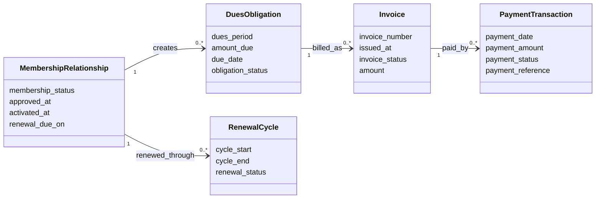
```mermaid
classDiagram
    direction LR

    class MembershipRelationship {
      membership_status
      approved_at
      activated_at
      renewal_due_on
    }

    class DuesObligation {
      dues_period
      amount_due
      due_date
      obligation_status
    }

    class Invoice {
      invoice_number
      issued_at
      invoice_status
      amount
    }

    class PaymentTransaction {
      payment_date
      payment_amount
      payment_status
      payment_reference
    }

    class RenewalCycle {
      cycle_start
      cycle_end
      renewal_status
    }

    MembershipRelationship "1" --> "0..*" DuesObligation : creates
    DuesObligation "1" --> "0..*" Invoice : billed_as
    Invoice "1" --> "0..*" PaymentTransaction : paid_by
    MembershipRelationship "1" --> "0..*" RenewalCycle : renewed_through
```

Membership lifecycle from the repo:

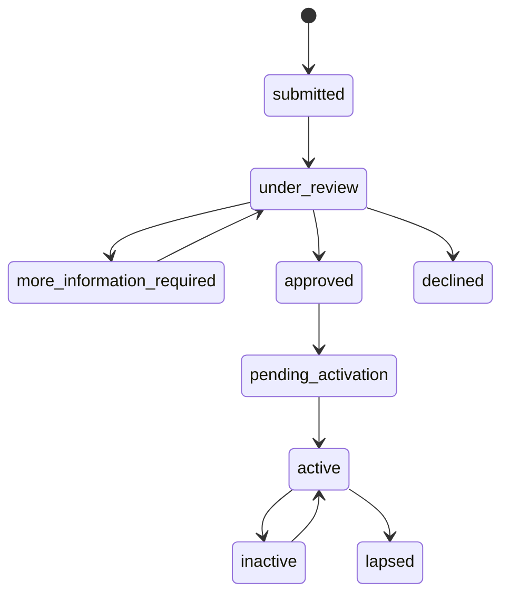
```mermaid
stateDiagram-v2
    [*] --> submitted
    submitted --> under_review
    under_review --> more_information_required
    more_information_required --> under_review
    under_review --> approved
    under_review --> declined
    approved --> pending_activation
    pending_activation --> active
    active --> inactive
    active --> lapsed
    inactive --> active
```

Reading:

- approval is not activation
- finance records sit between approval and active membership
- renewal and lapse are not the same thing as initial application review

## 8. Communications, channels, and opt-ins

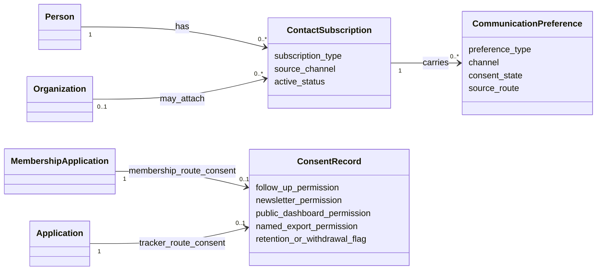
```mermaid
classDiagram
    direction LR

    class Person
    class Organization

    class ContactSubscription {
      subscription_type
      source_channel
      active_status
    }

    class CommunicationPreference {
      preference_type
      channel
      consent_state
      source_route
    }

    class ConsentRecord {
      follow_up_permission
      newsletter_permission
      public_dashboard_permission
      named_export_permission
      retention_or_withdrawal_flag
    }

    class MembershipApplication
    class Application

    Person "1" --> "0..*" ContactSubscription : has
    Organization "0..1" --> "0..*" ContactSubscription : may_attach
    ContactSubscription "1" --> "0..*" CommunicationPreference : carries
    MembershipApplication "1" --> "0..1" ConsentRecord : membership_route_consent
    Application "1" --> "0..1" ConsentRecord : tracker_route_consent
```

Current communication/opt-in concepts already present in the repo:

- `follow-up consent`
- `newsletter consent`
- `aggregate advocacy/reporting consent`
- `named registrar/export permission`
- `stay informed / updates relationship`
- source or acquisition channel

Current communication topics mentioned in the repo:

- newsletter
- advocacy or campaign communication
- convening and event communication
- fundraising follow-up
- technical-network follow-up

Notes:

- the repo is stronger on opt-in topics than on final delivery channels
- email is clearly present
- other channels are not yet deeply specified and should be treated as open

## 9. Biologicals Explorer and member-product listing model

This area is less fully specified than membership and tracker, but it is clearly part of the ABA proposition.

What is already clear from the repo:

- the Explorer is a distinct public knowledge layer
- it includes products, crops, pests/diseases, evidence, standards, and regulations
- one membership perk is product listing / visibility in the Explorer
- the Explorer is its own self-contained module/product boundary, even if it shares core records with the rest of ABA; it should be easy to carve out with minimal integration needed to keep it running in the future

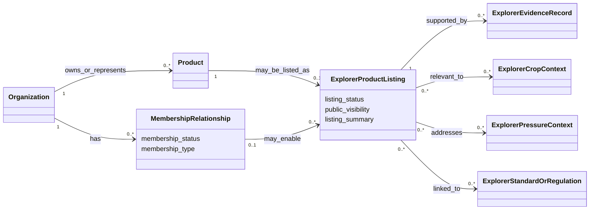
```mermaid
classDiagram
    direction LR

    class Organization
    class MembershipRelationship {
      membership_status
      membership_type
    }
    class Product
    class ExplorerProductListing {
      listing_status
      public_visibility
      listing_summary
    }
    class ExplorerEvidenceRecord
    class ExplorerCropContext
    class ExplorerPressureContext
    class ExplorerStandardOrRegulation

    Organization "1" --> "0..*" Product : owns_or_represents
    Organization "1" --> "0..*" MembershipRelationship : has
    Product "1" --> "0..1" ExplorerProductListing : may_be_listed_as
    MembershipRelationship "0..1" --> "0..*" ExplorerProductListing : may_enable
    ExplorerProductListing "1" --> "0..*" ExplorerEvidenceRecord : supported_by
    ExplorerProductListing "0..*" --> "0..*" ExplorerCropContext : relevant_to
    ExplorerProductListing "0..*" --> "0..*" ExplorerPressureContext : addresses
    ExplorerProductListing "0..*" --> "0..*" ExplorerStandardOrRegulation : linked_to
```

Recommended interpretation:

- `Product` remains the shared core record
- the Explorer should not own product identity separately
- if member products are a perk, that perk should likely act through a listing/publication record such as `ExplorerProductListing`
- listing eligibility should be governed by membership status plus product/listing rules, not by duplicating product records into a separate Explorer-only model

Open point:

- the repo does not yet fully lock whether every listed product must belong to an active member, or whether some public knowledge records may exist without that relationship

## 10. Full member route capture model

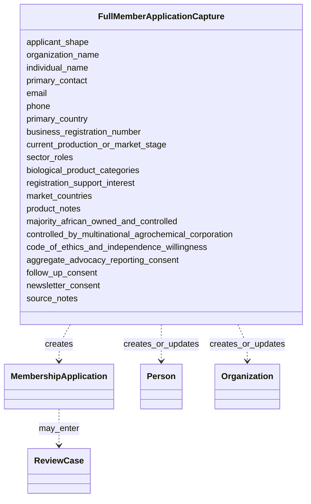
```mermaid
classDiagram
    direction TB

    class FullMemberApplicationCapture {
      applicant_shape
      organization_name
      individual_name
      primary_contact
      email
      phone
      primary_country
      business_registration_number
      current_production_or_market_stage
      sector_roles
      biological_product_categories
      registration_support_interest
      market_countries
      product_notes
      majority_african_owned_and_controlled
      controlled_by_multinational_agrochemical_corporation
      code_of_ethics_and_independence_willingness
      aggregate_advocacy_reporting_consent
      follow_up_consent
      newsletter_consent
      source_notes
    }

    class MembershipApplication
    class Person
    class Organization
    class ReviewCase

    FullMemberApplicationCapture ..> MembershipApplication : creates
    FullMemberApplicationCapture ..> Person : creates_or_updates
    FullMemberApplicationCapture ..> Organization : creates_or_updates
    MembershipApplication ..> ReviewCase : may_enter
```

## 11. Technical network route capture model

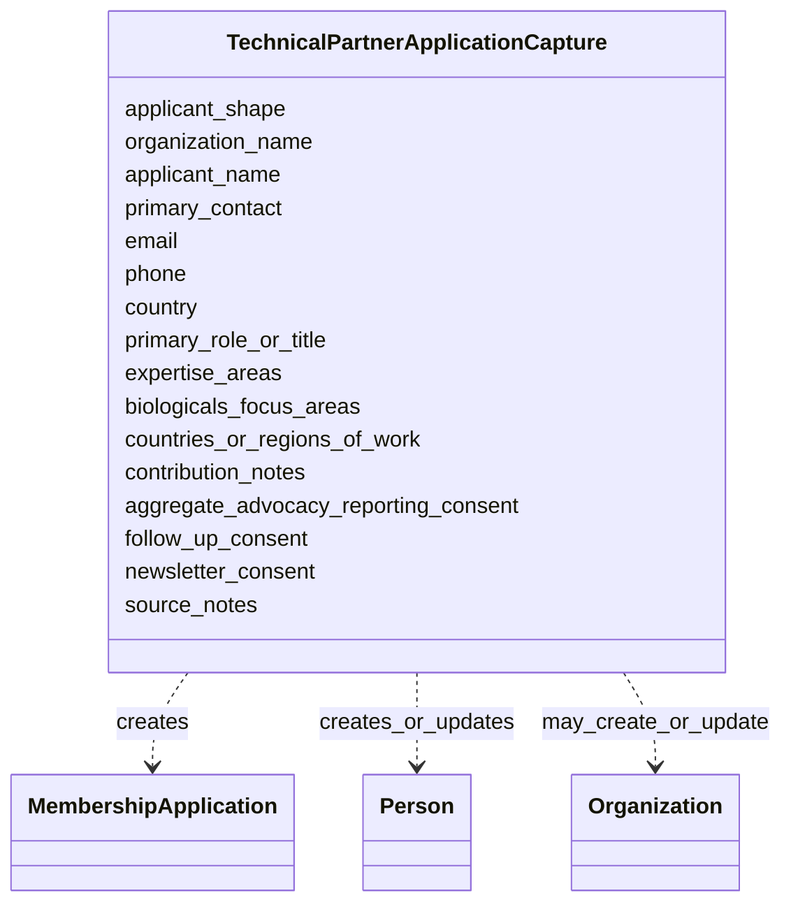
```mermaid
classDiagram
    direction TB

    class TechnicalPartnerApplicationCapture {
      applicant_shape
      organization_name
      applicant_name
      primary_contact
      email
      phone
      country
      primary_role_or_title
      expertise_areas
      biologicals_focus_areas
      countries_or_regions_of_work
      contribution_notes
      aggregate_advocacy_reporting_consent
      follow_up_consent
      newsletter_consent
      source_notes
    }

    class MembershipApplication
    class Person
    class Organization

    TechnicalPartnerApplicationCapture ..> MembershipApplication : creates
    TechnicalPartnerApplicationCapture ..> Person : creates_or_updates
    TechnicalPartnerApplicationCapture ..> Organization : may_create_or_update
```

## 12. Observer route capture model

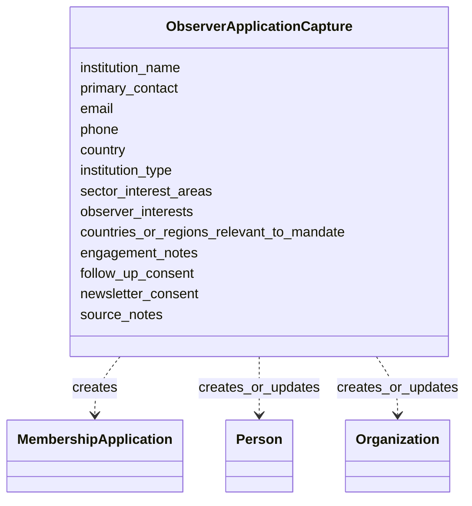
```mermaid
classDiagram
    direction TB

    class ObserverApplicationCapture {
      institution_name
      primary_contact
      email
      phone
      country
      institution_type
      sector_interest_areas
      observer_interests
      countries_or_regions_relevant_to_mandate
      engagement_notes
      follow_up_consent
      newsletter_consent
      source_notes
    }

    class MembershipApplication
    class Person
    class Organization

    ObserverApplicationCapture ..> MembershipApplication : creates
    ObserverApplicationCapture ..> Person : creates_or_updates
    ObserverApplicationCapture ..> Organization : creates_or_updates
```

## 13. Registration tracker route capture model

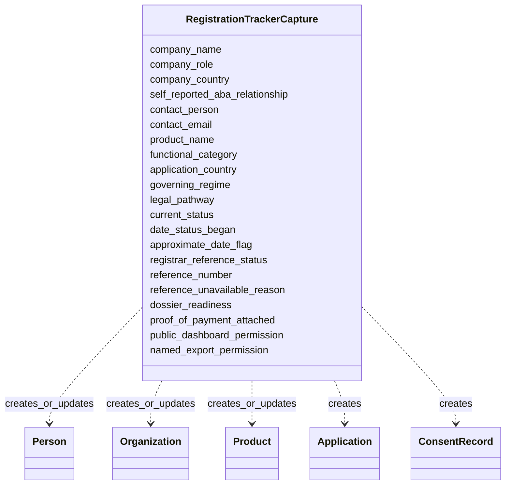
```mermaid
classDiagram
    direction TB

    class RegistrationTrackerCapture {
      company_name
      company_role
      company_country
      self_reported_aba_relationship
      contact_person
      contact_email
      product_name
      functional_category
      application_country
      governing_regime
      legal_pathway
      current_status
      date_status_began
      approximate_date_flag
      registrar_reference_status
      reference_number
      reference_unavailable_reason
      dossier_readiness
      proof_of_payment_attached
      public_dashboard_permission
      named_export_permission
    }

    class Person
    class Organization
    class Product
    class Application
    class ConsentRecord

    RegistrationTrackerCapture ..> Person : creates_or_updates
    RegistrationTrackerCapture ..> Organization : creates_or_updates
    RegistrationTrackerCapture ..> Product : creates_or_updates
    RegistrationTrackerCapture ..> Application : creates
    RegistrationTrackerCapture ..> ConsentRecord : creates
```

## 14. Registration tracker slice

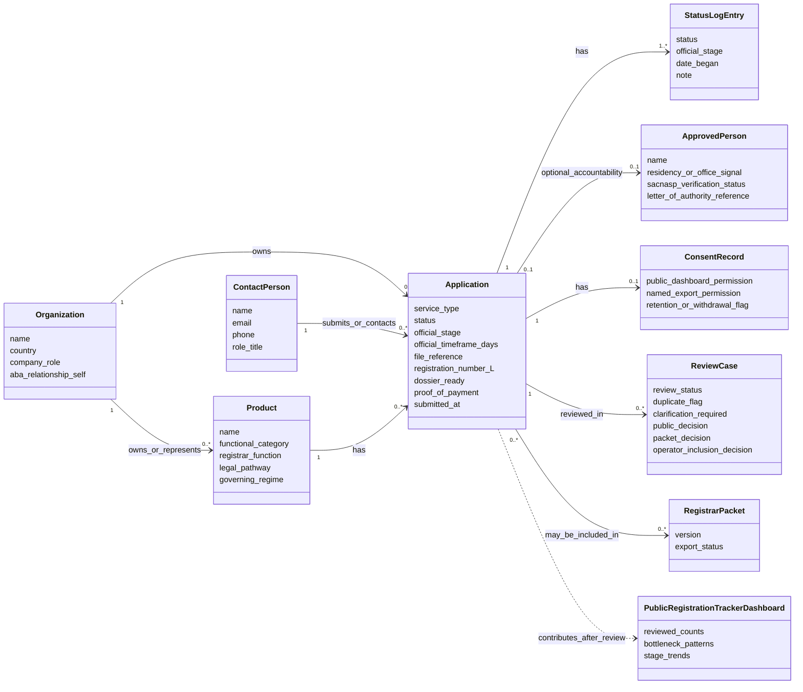
```mermaid
classDiagram
    direction LR

    class Organization {
      name
      country
      company_role
      aba_relationship_self
    }

    class ContactPerson {
      name
      email
      phone
      role_title
    }

    class Product {
      name
      functional_category
      registrar_function
      legal_pathway
      governing_regime
    }

    class Application {
      service_type
      status
      official_stage
      official_timeframe_days
      file_reference
      registration_number_L
      dossier_ready
      proof_of_payment
      submitted_at
    }

    class StatusLogEntry {
      status
      official_stage
      date_began
      note
    }

    class ApprovedPerson {
      name
      residency_or_office_signal
      sacnasp_verification_status
      letter_of_authority_reference
    }

    class ConsentRecord {
      public_dashboard_permission
      named_export_permission
      retention_or_withdrawal_flag
    }

    class ReviewCase {
      review_status
      duplicate_flag
      clarification_required
      public_decision
      packet_decision
      operator_inclusion_decision
    }

    class RegistrarPacket {
      version
      export_status
    }

    class PublicRegistrationTrackerDashboard {
      reviewed_counts
      bottleneck_patterns
      stage_trends
    }

    Organization "1" --> "0..*" Product : owns_or_represents
    Organization "1" --> "0..*" Application : owns
    ContactPerson "1" --> "0..*" Application : submits_or_contacts
    Product "1" --> "0..*" Application : has
    Application "1" --> "1..*" StatusLogEntry : has
    Application "0..1" --> "0..1" ApprovedPerson : optional_accountability
    Application "1" --> "0..1" ConsentRecord : has
    Application "1" --> "0..*" ReviewCase : reviewed_in
    Application "0..*" --> "0..*" RegistrarPacket : may_be_included_in
    Application ..> PublicRegistrationTrackerDashboard : contributes_after_review
```

Reading:

- `Application` is the main registration-tracker record
- `Product` is not the same thing as `Application`
- one `Product` may have multiple `Application` records over time
- review and consent gate whether an `Application` can affect the public dashboard or any registrar export batch

## 15. Service Request Form, Application Form, and receipt/admin grouping

The clearest current recommendation is:

- `Application` remains the main registration record
- the `Service Request Form` is not standalone; it sits with one or more application forms
- if ABA needs to preserve the distinct administrative data from the service request, then yes, it should have a separate grouping/admin record

Recommended shape:

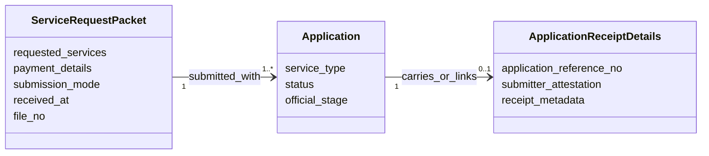
```mermaid
classDiagram
    direction LR

    class ServiceRequestPacket {
      requested_services
      payment_details
      submission_mode
      received_at
      file_no
    }

    class Application {
      service_type
      status
      official_stage
    }

    class ApplicationReceiptDetails {
      application_reference_no
      submitter_attestation
      receipt_metadata
    }

    ServiceRequestPacket "1" --> "1..*" Application : submitted_with
    Application "1" --> "0..1" ApplicationReceiptDetails : carries_or_links
```

Working interpretation:

- a service request packet requires at least one application
- the service request packet has different data from the application itself
- that means ABA probably does need some way to manage that data separately if receipt/payment/admin tracking matters
- but that record should be an admin/grouping record around applications, not a replacement for the `Application` business record

## 16. Source forms versus ABA records

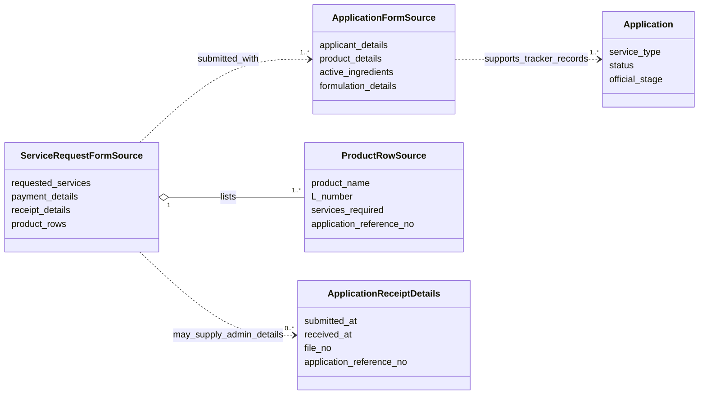
```mermaid
classDiagram
    direction LR

    class ServiceRequestFormSource {
      requested_services
      payment_details
      receipt_details
      product_rows
    }

    class ApplicationFormSource {
      applicant_details
      product_details
      active_ingredients
      formulation_details
    }

    class ProductRowSource {
      product_name
      L_number
      services_required
      application_reference_no
    }

    class Application {
      service_type
      status
      official_stage
    }

    class ApplicationReceiptDetails {
      submitted_at
      received_at
      file_no
      application_reference_no
    }

    ServiceRequestFormSource "1" o-- "1..*" ProductRowSource : lists
    ServiceRequestFormSource ..> "1..*" ApplicationFormSource : submitted_with
    ApplicationFormSource ..> "1..*" Application : supports_tracker_records
    ServiceRequestFormSource ..> "0..*" ApplicationReceiptDetails : may_supply_admin_details
```

Reading:

- the regulator documents clearly define the `Application form`
- the `Service Request Form` sits around it as the cover, receipt, and service-summary form
- the source docs support one service request covering multiple application form(s) and multiple product rows
- the source docs do not cleanly settle the final ABA storage rule for a separate received-packet record

## 17. Current workshop-safe cardinality rules

- `Organization 1 -> many Product`
- `Organization 1 -> many Application`
- `Product 1 -> many Application` over time
- `Application 1 -> many StatusLogEntry`
- `Application 0..1 -> ConsentRecord`
- `Application many <-> many RegistrarPacket`
- `ServiceRequestPacket 1 -> one-or-many Application` if ABA stores receipt/admin grouping explicitly
- `MembershipCategory 1 -> many MembershipTypePolicy`
- `MembershipRelationship 1 -> many DuesObligation`
- `Invoice 1 -> many PaymentTransaction`

## 18. Current open cardinality questions

- whether one source application form should always map to exactly one ABA `Application` record
- whether `Observer` always becomes a true `MembershipRelationship` or sometimes a lighter stakeholder relationship
- what the final user-role assignment model is for company users, operators, finance, and chapters
- what the final communications-channel model is beyond the current opt-ins
- what the exact eligibility rule is for member products to appear in the Biologicals Explorer
- the deduplication rule when a company or person resubmits related material later
