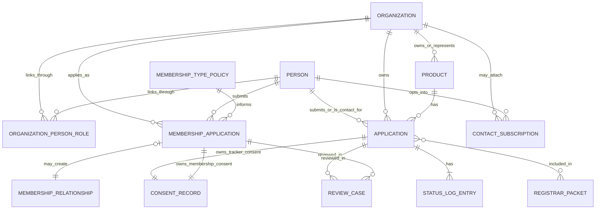

# ABA System Model Workshop Reference: Actors, Attributes, Relationships, And Business Rules

Last updated: 2026-07-14

## Purpose

This note is a workshop reference for tomorrow's ABA UX and taxonomy session.
Its scope is the whole ABA system, including the registration tracker.

It is intended to answer 5 things directly:
- who the actors are
- what records currently exist in the repo model
- what attributes are already captured or explicitly implied
- how those records relate to one another
- which business rules are already stated versus still unresolved

This note does not propose new product direction.

It consolidates what is already modeled or specified across:
- `docs/requirements/aba-unified-membership-tracker-system-contract.md`
- `docs/requirements/aba-prototype-system-model.md`
- `docs/requirements/aba-public-capture-journeys-and-record-model.md`
- `docs/requirements/aba-public-capture-field-map.md`
- `docs/requirements/aba-membership-type-policy.md`
- `docs/requirements/aba-admin-surface-taxonomy.md`
- `registration-tracker/data-model-v1.md`
- `registration-tracker/intake-form-spec-v1.md`
- `registration-tracker/page-feed-map-v1.md`
- the 2026-07-12 meeting transcript

Primary regulator reference documents are now stored in:
- `registration-tracker/reference/regulator-source-docs/`

## 1. Critical grounding

### What the regulator forms actually show

The regulator corpus gives us two different documents that work together:

| Document | What it is | What it contains | What it tells us |
|---|---|---|---|
| `Application form` | the substantive regulator form | applicant details, product details, actives, formulation, supporting regulatory information | the source docs clearly define `application` as a real business object |
| `Service Request Form` | the cover / receipt / service-summary form | requested services, payment details, receipt handling, product rows, application reference handling | one service request can accompany the relevant application form(s) and supporting documentation |

What that means in plain language:

- the `Application form` is the detailed form for the registration matter itself
- the `Service Request Form` is the administrative sheet sent with the relevant application form(s)
- the Service Request Form explicitly allows multiple application form(s), multiple requested services, and multiple product rows
- the source docs therefore support a received packet that may cover more than one application

What the forms do **not** settle cleanly on their own:

- whether ABA should store the received packet as its own first-class system record
- the final rule for when one product maps to one application versus several applications over time
- the exact deduplication rule when a company comes back with another form later

### Application versus receipt details

These are not the same thing.

| Term | Meaning in the current model | What it contains | Plain rule |
|---|---|---|---|
| `Application` | the application-level regulatory record | service/application type, status timeline, stage, benchmark/wait logic, readiness flags, company-workspace state | this is the record whose progress ABA is tracking |
| `receipt or intake details` | the administrative details about ABA receiving the material | submitter context, responsible attestation, route-specific consent, receipt or submit timestamps | useful operationally, but not strong evidence for a separate source-defined business object |

Working interpretation for the workshop:

- a service request may cover more than one application
- the application form itself appears to describe one product/application dossier at a time because the product data in that form is singular
- a product may therefore have more than one application over time
- the repo should not claim a rigid product-to-application rule beyond what the source documents clearly support

### How to explain the two forms together

Use this wording:

- the application form is the detailed regulatory form
- the service request form is the cover and receipt form submitted with the relevant application form(s)
- ABA may need to capture both the application itself and some receipt/admin details about how it arrived
- ABA should not invent a second formal business object unless there is a product reason to do so

### Source-defined terms versus ABA-side modeling

The repo now needs to distinguish 3 layers clearly:

| Layer | Meaning |
|---|---|
| `Source-defined` | terms or process structures clearly present in the regulator documents |
| `ABA-side modeling` | tracker/CRM structures introduced by ABA to organize, review, or operationalize the source process |
| `Open question` | a point the source documents do not settle cleanly and the ABA model still needs to decide |

Source-defined examples:
- `application`
- application/service categories
- file/reference mechanics
- approved-person responsibilities
- verification, scientific screening, evaluation, decision, appeal

ABA-side modeling examples:
- splitting tracker records into `Organization`, `Product`, `Application`, and `StatusLogEntry`
- mapping tracker records into CRM continuity objects

Open-question examples:
- whether a separate received-packet record is truly needed
- how one received packet with multiple products/services should normalize into tracker grain
- what the final matching rule should be for repeated submissions against existing orgs/products/applications

### Tracker-package names versus shared ABA names

The repo currently uses two layers of naming:
- tracker-package terminology inside `registration-tracker/`
- cross-journey terminology in the ABA requirements docs

Use this crosswalk during the workshop:

| Tracker package term | Shared ABA term | Notes |
|---|---|---|
| `Organisation` | `Organization` | shared org spine |
| `ContactPerson` | `Person` plus `OrganizationPersonRole` | tracker package is flatter here |
| `Application` | `Application` | the record whose regulatory progress is tracked |
| `StatusLogEntry` | `StatusLogEntry` | same idea in both layers |
| `ConsentSetting` | `ConsentRecord` | tracker-route consent owner |
| `ApprovedPerson` | optional accountability sub-record | optional tracker leaf, not core cross-journey spine |

## 2. Actors

## 2.1 Public and participant actors

| Actor | Primary intent | Records they create or use | Key attributes currently modeled or implied | Key business rules already stated |
|---|---|---|---|---|
| `Public visitor` | read public site, choose a route | may create nothing yet | none until route chosen | cannot see company-private, operator-only, or registrar/export-only data |
| `Full membership applicant` | apply for reviewed commercial membership | `Person`, optional `Organization`, `OrganizationPersonRole`, `MembershipApplication`, membership-side `ConsentRecord` | applicant shape, organisation name, individual name where relevant, primary contact, email, phone, primary country, business registration number, production or market stage, sector roles, biological product categories, registration-support interest, market countries, independence signals, consent fields | membership application is separate from tracker intake; approval does not make the member active; applied and approved category/type must remain separate |
| `Technical network applicant` | join ABA's technical network as a specialist or contributor | `Person`, optional `Organization`, `OrganizationPersonRole`, `MembershipApplication`, membership-side `ConsentRecord` | applicant shape, organisation name, applicant name, primary contact, email, phone, country, role/title, expertise areas, biologicals focus areas, countries or regions of work, contribution notes, consent fields | system category is `Technical partner`; current public route may still say `Associate`; this route should capture expertise and contribution rather than commercial product ownership |
| `Observer or institutional stakeholder applicant` | join as an institutional or stakeholder participant | `Organization`, `Person`, `OrganizationPersonRole`, `MembershipApplication`, membership-side `ConsentRecord` | institution name, primary contact, email, phone, country, institution type, sector interest areas, observer interests, countries or regions relevant to mandate, engagement notes, follow-up/newsletter consent | this route is institution-first; it should not behave like a generic person-or-organisation member form |
| `Non-member registration submitter` | submit tracker data before becoming a member | `Person` if new, `Organization` if new, `OrganizationPersonRole`, tracker-side `ConsentRecord`, one or more `Product`, one or more `Application` | company name, company role, company country, self-reported ABA relationship, contact name, contact email, phone where used, product details, service/application type, status data, reference status, readiness flags, tracker consent | tracker route must remain open to non-members; non-member tracker continuity is mandatory; tracker consent does not imply membership consent |
| `Stay-informed contact` | receive updates or light-touch follow-up | `Person`, optional `Organization`, `ContactSubscription` | person, organisation where relevant, subscription type, source channel, consent flags, active status | this is separate from membership and tracker records but should still resolve to the same person spine |

## 2.2 Internal and governed actors

| Actor | Primary intent | Records they create or use | Key attributes currently modeled or implied | Key business rules already stated |
|---|---|---|---|---|
| `Member company user` | monitor company-scoped membership and tracker activity | uses `Organization`, `MembershipRelationship`, `Application`, `StatusLogEntry`, possibly `ReviewCase` outcomes surfaced to them | company-scoped access, member-facing statuses, blockers, evidence readiness, next actions | may only see their own organisation's records; may not see other organisations or operator-only notes |
| `ABA operator` | review, classify, follow up, include, exclude, and activate | uses `MembershipApplication`, `MembershipRelationship`, `Application`, `ReviewCase`, `MembershipTypePolicy`, later `RegistrarPacket` | review status, approval/decline decision, category/type reclassification, invoice/payment follow-up, public aggregate inclusion, export eligibility, clarification, exclusion | operator review is the gate between raw input and public/company/export outputs |
| `Registrar/export context` | view a narrower named evidence subset | uses reviewed `Application` records through `RegistrarPacket` or export preview logic | packet version, inclusion status, export-ready completeness | registrar/export use is narrower than company-private visibility and narrower than public aggregate use |
| `Approved person` | optional accountable person under tracker intake | optional tracker leaf attached through accountability module | name, role, SA residency or office signal, SACNASP verification status, letter-of-authority reference | optional, non-gating, own-record sensitive, never public raw |

## 3. Person and organisation relationship roles

The repo already implies that the same `Person` may hold different roles over time.

Those roles belong on the relationship between person and organisation, not only on the person record.

| Role carried by `OrganizationPersonRole` | Where it appears now | Notes |
|---|---|---|
| `primary_contact` | membership routes, observer route, tracker route | organisation-facing contact point |
| `applicant` | membership routes | the person making the membership application |
| `authorised_tracker_submitter` | tracker route | authority should belong on the organisation-person link, not globally on `Person` |
| `member_company_user` | member workspace | internal/company-scoped access role |
| `observer_representative` | observer route | institution-first relationship context |

## 4. Shared system records

## 4.1 Shared spine records

| Record | Purpose | Key attributes currently modeled or implied | Relationships | Business rules already stated | Known gaps or unresolved areas |
|---|---|---|---|---|---|
| `Person` | one named human contact in ABA | full_name, email, phone, role_title, acquisition_channel, relationship_stage, organisation link, authorisation status where relevant | may link to many `Organization` records through `OrganizationPersonRole`; may submit `MembershipApplication`; may be linked to tracker-side applications and intake metadata; may hold `ContactSubscription` | every human should resolve to one `Person`; one person may hold multiple roles; route of entry should be preserved through metadata rather than duplicate people | matching/deduplication rules across routes are not fully specified |
| `Organization` | one company, institution, lab, agency, association, or other body interacting with ABA | organization_name, organization_type, primary_country, membership_relationship, membership_status, ownership or independence notes | may link to many `Person`; may have many `MembershipApplication`; may later hold one or more `MembershipRelationship`; may have many tracker-side applications; may have many `Product` | organisation may exist before membership approval; tracker-origin organisations may later become members without replacement | exact matching rules for repeated capture across routes are not yet fully specified |
| `OrganizationPersonRole` | carries context of one person's relationship to one organisation | role type, authority context, primary-contact context, route context | joins `Person` to `Organization` | authority to submit tracker data belongs here, not globally on `Person` | field-level structure for this record is still lightly specified compared with the rest of the model |

## 4.2 Membership records

| Record | Purpose | Key attributes currently modeled or implied | Relationships | Business rules already stated | Known gaps or unresolved areas |
|---|---|---|---|---|---|
| `MembershipTypePolicy` | managed policy object for membership types | membership_category_code, membership_type_code, public_label, membership_category, description, annual_dues_amount, currency, billing_cycle, voting_rights, governance_participation_level, workspace_access_scope, tracker_support_scope, review_requirements_summary, is_active, display_order, effective dates, fee notes | informs `MembershipApplication`; governs `MembershipRelationship` | public forms should not hard-code long-term type semantics; types may change without rewriting historical applications | full internal policy administration flow is not fully modeled in the UI yet |
| `MembershipApplication` | one public-side membership application for one route and review cycle | applicant_shape, applicant_person, organization_link, application_route, applied_membership_category, applied_membership_type, approved_membership_category, approved_membership_type, primary_country, sector_roles, activity_areas, market_countries, registration_support_interest, has_products flag, consent flags, source notes, operator notes, operator_decision_reason, invoicing_required flag | created from full member, technical partner, or observer route; may create `MembershipRelationship`; may be reviewed through `ReviewCase`; links to `Person` and optional `Organization` | one application is not yet a membership relationship; route context determines much category meaning; review may confirm or revise approved category/type; application states are `draft`, `submitted`, `under_review`, `more_information_required`, `approved`, `declined`, `withdrawn` | exact split between first-capture fields and review-stage fields is still being refined; observer may become either full membership relationship or lighter stakeholder relationship depending on later decisions |
| `MembershipRelationship` | durable approved ABA relationship | membership_category, membership_type, membership_status, verified_relationship_label, country_scope, member_visibility_scope, application_link, approved_at, activated_at, annual_dues_amount, dues_cycle, invoice_status, payment_status, renewal_due_on, privileges_summary | created from approved `MembershipApplication`; linked to `Organization` and/or individual member context | approval and activation are separate; `pending_activation` persists until dues, invoicing, and onboarding are complete; relationship states are `pending_activation`, `active`, `inactive`, `lapsed` | supporting finance records such as invoice, dues obligation, and payment are implied but not yet fully consolidated in the cross-journey contract |

## 4.3 Tracker records

| Record | Purpose | Key attributes currently modeled or implied | Relationships | Business rules already stated | Known gaps or unresolved areas |
|---|---|---|---|---|---|
| `Product` | one named product or product concept linked to tracker activity | product_name, functional_category, registrar_function mapping, legal_pathway, governing_regime, application_country, optional data_path_tag | linked to `Organization`; may be created or updated alongside application intake; may have many `Application` records over time | product identity should not be collapsed into the application context | limited deeper product metadata is captured in the public tracker route today |
| `Application` | one application-level registration record | service_type, status, official_stage, official_timeframe_days, file_reference, file_reference_status, registration_number_L when post-registration, dossier_ready, proof_of_payment, granted_date, term_end_date, renew_by_date, is_pipeline, optional approved_person link, intake/receipt metadata such as submit timestamp and tracker-side consent linkage | linked to `Product`; linked to `Organization`; linked to `Person` through contact/submitter context; has many `StatusLogEntry`; may later feed company workspace, the public registration tracker dashboard, and `RegistrarPacket` after review | `application` is source-defined in the regulator corpus; this is the record whose regulatory progress ABA tracks; intake and receipt details may be attached as metadata but should not be presented as a second source-defined business object; public and export decisions operate on reviewed applications, not receipt/admin data alone | matching repeated submissions to existing products/applications is not fully specified; long-term link from prior tracker history to later active membership is conceptually specified but not fully operationalized |
| `StatusLogEntry` | dated timeline point for an application | status, official_stage, date_began, is_approximate, optional note | belongs to `Application` | wait time is derived from these entries and should not be typed independently onto the application | detailed status-authoring and correction workflow is not fully specified |
| optional accountability sub-record | optional tracker leaf for accountable-person details | approved person name, role, SA residency or office signal, SACNASP verification status, letter-of-authority reference | attaches to tracker-side application/accountability context | optional, non-gating, sensitive, not a core cross-journey spine record | final structural placement in the cross-journey model is lighter than the tracker-package draft |
| lookup tables | controlled reference data used by tracker logic | `ServiceType`, `StatusVocabulary`, `OfficialStage`, `LegalPathway`, `FunctionalCategory` to `RegistrarFunction`, `ABARelationshipType`, country, regime, bottleneck theme | referenced by tracker entities | tracker uses controlled lists rather than freeform vocabulary for key regulatory fields | some mappings remain provisional, especially product category to registrar function |

## 4.4 Workflow, consent, and output records

| Record | Purpose | Key attributes currently modeled or implied | Relationships | Business rules already stated | Known gaps or unresolved areas |
|---|---|---|---|---|---|
| `ConsentRecord` | route-owned permission bundle | follow-up permission, newsletter permission where relevant, public aggregate permission, named registrar/export permission, retention or withdrawal flags | owned by source route: membership-side on `MembershipApplication`, tracker-side on the application at intake | tracker consent does not imply membership consent; membership consent does not imply tracker consent; ownership remains with the source route | later standing-member permissions versus historical route permissions still need careful operational design |
| `ReviewCase` | operator-managed review and follow-up object | review_status, owner, clarification_required, duplicate flag, public decision, packet decision, operator inclusion decision, follow-up action | linked to `MembershipApplication` or tracker-side review target; used by operators | review states should include `new`, `in_review`, `clarification_requested`, `resolved`, `excluded`; source record stores facts, review record stores governed decision trail | exact field set and lifecycle are not fully specified across all modules |
| `ContactSubscription` | non-membership updates relationship | person_link, organization_link where relevant, subscription_type, source_channel, advocacy or recruitment permissions where used, newsletter_consent, active_status | linked to `Person` and optional `Organization` | separate from membership and tracker, but should resolve to same person spine | richer subscription segmentation is implied more than fully defined |
| `RegistrarPacket` | optional later export-batch record | versioned inclusion list, export status, packet snapshot metadata | may include reviewed `Application` records | preview-only for v1 unless deeper implementation work lands; packet eligibility is narrower than company-private visibility | packet structure, versioning, and downstream workflow are not yet deeply modeled |
| `Public registration tracker dashboard` | reviewed public-facing dashboard view of tracker data | country counts, stage counts, bottleneck patterns, time-in-stage trends, public narrative framing | derived from reviewed `Application` records with public dashboard permission | public dashboard data must never derive directly from raw intake alone; only reviewed, consent-cleared aggregate data may be used | whether this becomes a first-class stored reporting object or remains a derived view is still open |

## 5. Route-by-route capture attributes

This section focuses on the fields already visible in the current public routes.

## 5.1 Shared membership-route attributes

Across the membership routes, the current model repeatedly captures or implies:
- application_route
- applicant_shape
- applicant person name
- organisation or institution name where relevant
- primary contact name
- email
- phone
- primary country
- market or regional relevance
- follow-up consent
- newsletter consent
- source or acquisition channel

Internal-model note:
- `application_route`
- `applied_membership_category`
- `applied_membership_type`

still matter in the model, but the public forms should not necessarily expose all of them as first-pass dropdowns.

## 5.2 Full member route attributes

Current route source:
- `docs/membership-flow/apply-full.html`

Current captured or implied fields:
- applicant shape
- organisation name
- individual name
- primary contact
- email
- phone
- primary country
- business registration number
- current production or market stage
- role(s) in the biologicals sector
- biological product categories
- whether registration or market-access support is needed
- countries where registration or market access matters
- product notes
- majority African-owned and controlled
- controlled by multinational agrochemical corporation
- willingness to subscribe to code of ethics and independence requirements
- aggregate advocacy/reporting consent
- follow-up consent
- newsletter consent
- source notes

## 5.3 Technical partner route attributes

Current route source:
- `docs/membership-flow/apply-associate.html`

Current captured or implied fields:
- applicant shape
- organisation name
- applicant name
- primary contact
- email
- phone
- country
- primary role or title
- expertise areas
- biologicals focus areas
- countries or regions of work
- contribution notes
- aggregate advocacy/reporting consent
- follow-up consent
- newsletter consent
- source notes

Important taxonomy rule:
- system category is `Technical partner`
- current route implementation may still use `Associate`

## 5.4 Observer or institutional route attributes

Current route source:
- `docs/membership-flow/apply-observer.html`

Current captured or implied fields:
- institution name
- primary contact
- email
- phone
- country
- institution type
- sector interest areas
- observer interests
- countries or regions relevant to mandate
- engagement notes
- follow-up consent
- newsletter consent
- source notes

## 5.5 Tracker-route attributes

Current route source:
- `registration-tracker/intake-flow/index.html`

Tracker-package field set currently modeled includes:

### Company and contact context
- company name
- company role
- company country
- self-reported ABA relationship
- contact name
- contact email
- phone where used
- role/title where used
- permission to contact
- responsible attestation

### Product and regulatory context
- product name
- functional category
- country for application
- governing regime
- Act 36 legal pathway where relevant
- optional data-path tag

### Application-level context
- service/application type
- official timeframe benchmark
- current status
- official stage
- date status began
- approximate date flag
- file reference
- file reference status
- reason where reference not provided
- registration number L when post-registration only
- dossier readiness flag
- proof-of-payment flag
- granted date and renewal-derived dates where relevant
- pipeline flag

### Optional accountability context
- approved person name
- approved person role
- SA residency or office eligibility signal
- SACNASP verification status
- acting under letter of authority

### Consent and usage context
- internal ABA review
- anonymised public aggregate use
- named or registrar-facing use
- retention or withdrawal state

## 6. Relationship map

## 7. Business rules already stated in the repo

## 7.1 Cross-journey rules

- membership application is not tracker intake
- tracker intake is not membership approval
- both routes must still attach to one shared person-organisation spine over time
- membership-to-tracker handoff is a linked next step, not an automatic record creation at first capture
- non-member tracker continuity is mandatory
- tracker-origin people and organisations may later become members without replacing prior tracker history

## 7.2 Membership rules

- membership category layer is `Full member`, `Technical partner`, and `Observer`
- current public `Associate` language is implementation language, not the intended long-term system label
- membership types sit inside categories and carry fee, privilege, review, and workspace consequences
- `applied_membership_category` and `approved_membership_category` must remain separate
- `applied_membership_type` and `approved_membership_type` must remain separate
- approval does not make a member active
- approved members must be invoiced and pay dues before activation
- membership relationship states are `pending_activation`, `active`, `inactive`, `lapsed`

## 7.3 Tracker rules

- tracker access is open to members and non-members
- tracker data rigor is intended to align with the Act 36 process map
- `Application` is the record whose regulatory progress ABA tracks
- intake and receipt details may be captured, but they should not be promoted into a second source-defined business object here
- wait time is derived from `StatusLogEntry`, not independently authored on the application
- public and export decisions should operate on reviewed application-level records, not raw receipt/admin data alone
- dossier contents and payment documents are not stored in the v1 tracker; only readiness or attached-state flags are stored
- optional accountability fields are non-gating
- service/application taxonomy is currently modeled at a detailed level, including more than just new registration and renewal

## 7.4 Consent and visibility rules

- consent belongs to the route that captured it
- tracker consent does not rewrite membership consent
- membership consent does not rewrite tracker consent
- current tracker intake behavior makes named or registrar-facing use visible but disabled until the submitter self-identifies as a Full ABA member
- durable visibility tiers are:
  - `PUBLIC_AGGREGATE`
  - `COMPANY_PRIVATE`
  - `OPERATOR_ONLY`
  - `NEVER_STORED`
- public signals must be reviewed and aggregate-safe
- public signals must never expose company name, product name, contact PII, file references, or other raw identifying detail
- company workspace is narrower than operator view
- registrar/export use is narrower than company-private use

## 7.5 Admin and workflow rules

- operator review is the central gate between raw input and downstream outputs
- `ReviewCase` should hold the governed decision trail rather than scattering those decisions across source records
- admin pages are not all the same class of surface; the repo distinguishes:
  - operational queues
  - managed record lists
  - reference data
  - observational surfaces

## 8. Missing relationships, ambiguities, and unresolved modeling areas

These are the areas the repo still leaves open or only partially modeled.

| Area | What is known | What is unresolved or incomplete |
|---|---|---|
| person and organisation matching | same person and organisation should persist across routes over time | exact deduplication and merge rules are not specified |
| tracker submitter to later member continuity | continuity is mandatory and prior history should be preserved | exact operational linking behavior for existing applications after membership approval is not fully specified |
| observer relationship type | observer route is institution-first and creates a membership-side application | whether every observer becomes the same kind of `MembershipRelationship` versus a lighter stakeholder relationship remains somewhat open in the repo notes |
| technical network modeling | technical partner is a system category and route | deeper capability matching, discoverability, directory rules, and advisory-availability modeling are not fully specified |
| review workflow | `ReviewCase` is the intended operator workflow object | detailed fields, owners, SLA behavior, and multi-pass review behavior are not fully specified |
| finance records | approval, invoicing, payment, activation, and lapse are explicitly distinct | exact shared record set for invoices, dues obligations, and payment events is not yet consolidated in the cross-journey contract |
| repeated tracker intake against existing applications | repeated intake should not create duplicate organisations or duplicate applications by accident | exact matching logic from new intake against existing products or existing applications is not yet fully specified |
| tracker product-owner versus submitter distinction | org/person relationship roles are recognized, and optional accountability fields exist | the first-capture tracker flow still captures submitter details more strongly than distinct product-owner structures |
| named/export eligibility gate | packet/export use is narrower than company-private visibility and named-use consent is required | the repo still needs one fully unified rule for whether export eligibility depends on self-reported membership, verified active membership, or some other narrower operator-controlled test |
| public signal persistence | public signals must derive from reviewed aggregate-safe tracker data | whether public signals are stored as a first-class reporting entity or only derived at runtime remains open |
| Africa-wide intelligence versus SA-deep process model | Africa-wide participation and intelligence are part of the ABA framing; Act 36 is the deepest process model in the tracker docs | how later non-South-African regulatory models will sit beside Act 36 is not yet modeled in the same depth |

## 9. Workshop-ready framing

If tomorrow's workshop needs a clean shared language, this is the simplest structure to use:

1. Actors
   - who is acting and why
2. Shared system records
   - what object gets created or updated
3. Relationships
   - how people, organisations, applications, memberships, and tracker records attach
4. Business rules
   - what is allowed, gated, deferred, or visible
5. Gaps
   - what still needs a product or UX decision

The most important distinction to keep clear throughout the session is:

- `Application` = the source-defined registration/business record
- receipt/intake details = operational context attached to that application if ABA needs it

That distinction is foundational to:
- progress tracking
- public signals
- company workspace design
- non-member to member continuity
- how tracker data should eventually land in a shared ABA CRM spine
