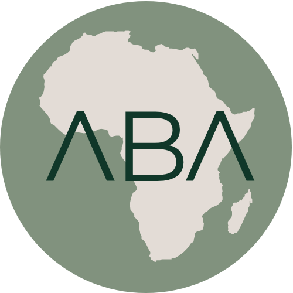

# ABA Soft-Launch Brand Palette

Status: approved by Jen
Last updated: 2026-07-20

## Source authority

The final mark is [`assets/aba-logo-final.png`](assets/aba-logo-final.png), copied unchanged from `/Users/nefiger/Downloads/New ABA Logo.png` on 2026-07-20.

The three main solid colours sampled directly from the logo are:

| Role in mark | Exact colour | RGB |
|---|---:|---:|
| Africa/background sage | `#81927E` | `129 146 126` |
| Africa/ground warm beige | `#E3DCD6` | `227 220 214` |
| ABA letterform deep green | `#103729` | `16 55 41` |

The final brochure's recurring orange was independently sampled as `#C4622D`. That becomes the principal warm accent because it connects the new logo to the brochure without importing the old prototype palette wholesale.

## Recommended launch palette

### Core green and sage

| Token | Colour | Use |
|---|---:|---|
| Forest depth | `#0B281E` | Darkest footer/hero depth; never pure black |
| Logo forest | `#103729` | Primary brand field, headings, primary controls, body text on light surfaces |
| Forest mid | `#2D5D49` | Supporting green, active states, diagrams |
| Sage deep | `#667762` | Secondary graphic structure; large text only after contrast check |
| Logo sage | `#81927E` | Signature supporting field, image treatments, broad low-intensity areas |
| Sage mist | `#B5C1B2` | Dividers, illustration fills, secondary surfaces |
| Sage wash | `#E7ECE5` | Quiet section background and form grouping |

### Warm neutral family

| Token | Colour | Use |
|---|---:|---|
| Reading paper | `#F7F3EE` | Main page ground; warmer and clearer than pure white |
| Pale beige | `#EFE9E4` | Alternate section ground |
| Logo beige | `#E3DCD6` | Signature brand neutral, strong surface distinction |
| Beige edge | `#CFC3B9` | Borders and muted illustration detail; not body text |
| Green ink | `#31463D` | Secondary text when a softer value than logo forest is needed |

### Brochure-derived orange family

| Token | Colour | Use |
|---|---:|---|
| Rust deep | `#963F1E` | High-contrast hover/pressed state, short labels, strong editorial emphasis |
| Action orange | `#AD4D24` | Accessible orange button or normal-size orange text on reading paper |
| Brochure orange | `#C4622D` | Signature accent for large type, numbering, rules, graphic moments, and non-text fills |
| Terracotta tint | `#E8B99E` | Illustration, data, or quiet supporting fill |
| Orange wash | `#F2DDD1` | Highlight background and form/supporting state |

### Optional supporting earth accent

| Token | Colour | Use |
|---|---:|---|
| Dry ochre | `#B98632` | Rare diagrams, data distinctions, or agriculture imagery; not small text on light backgrounds |
| Ochre wash | `#F0E4C8` | Soft background paired with forest text |

Ochre is optional. It should not compete with brochure orange or turn the site into a multicolour system.

## Contrast notes

Measured WCAG contrast ratios:

- logo forest `#103729` on logo beige `#E3DCD6`: `9.67:1`;
- logo forest `#103729` on reading paper `#F7F3EE`: `11.88:1`;
- green ink `#31463D` on reading paper: `9.17:1`;
- logo sage `#81927E` on reading paper: `3.00:1` — use for large type, UI boundaries, or graphics, not body copy;
- brochure orange `#C4622D` on reading paper: `3.70:1` — use for large type and graphics, not ordinary body text;
- action orange `#AD4D24` on reading paper: `4.92:1` — suitable for normal text and button fills with reading-paper text;
- rust deep `#963F1E` on reading paper: `6.28:1`.

Colour must never be the only carrier of status or meaning.

## Recommended balance

- approximately 60% warm paper/beige reading ground;
- approximately 30% deep green, sage structure, text, and photography treatment;
- no more than approximately 10% orange/ochre visual emphasis.

This is visual weight, not a literal pixel formula. Orange should feel like a purposeful spark running through the experience, as it does in the brochure.

### Registration Tracker application

- Keep page openings and the shared chrome in forest; keep the working and reading area predominantly paper.
- Use cream or sage wash only for contained supporting information that benefits from grouping.
- Do not use light orange as a full-width metrics or chapter background.
- Primary actions may use light orange on forest. On light surfaces, prefer a forest action unless orange is the page's single deliberate emphasis.
- Insight charts may use forest, sage-deep, rust-deep, and one muted neutral when distinct status categories genuinely require them. Do not create a separate tint for every chart or registration subtype.
- Provenance and privacy information should be typographically quiet and structurally clear; colour must not make internal methodology more prominent than the finding.

### Data infographic application

Pages using `tracker-module--data-infographic` retain the Registration Tracker palette.
The `tracker-module--signal-infographic` composition adds a marker-based synopsis,
question-specific chart forms, sage-wash plotting structure and rare orange benchmark or
exception marks. Forest carries the quantities; orange only changes meaning. Impact comes
from comparative scale, visible axes, direct labels and evidence density. Ranked bars,
ordered columns, grouped outcome bars and percentage bars are the default comparison
grammar; stacked bars are reserved for genuine part-to-whole questions. Interactive charts
use the pinned local Apache ECharts 6.1 SVG renderer and must retain hover/tap tooltips,
keyboard value navigation, responsive resizing, ARIA descriptions and accessible tables.
Do not turn the
page into a brochure spread, a metric-cell dashboard, a stack of interchangeable cards or
a rainbow chart.

## Logo rules for the reference prototype

- Use the supplied PNG unchanged while a vector master is unavailable.
- Do not recolour, crop, redraw, outline, shadow, or place the mark inside a second badge.
- Preserve its transparent exterior and circular silhouette.
- Give it enough scale to remain legible; do not repeat the earlier tiny-mark treatment.
- Avoid placing it over busy photography.
- If a vector master is later supplied, verify that its three colours match this asset before replacing it.

## Member-logo placeholders

The soft-launch prototype will reserve a founding/member logo area using clearly labelled neutral placeholder marks. Placeholders must communicate layout and realistic variation without inventing organisations or implying endorsement. Real logos enter only after the files, display permission, and member naming are confirmed.
